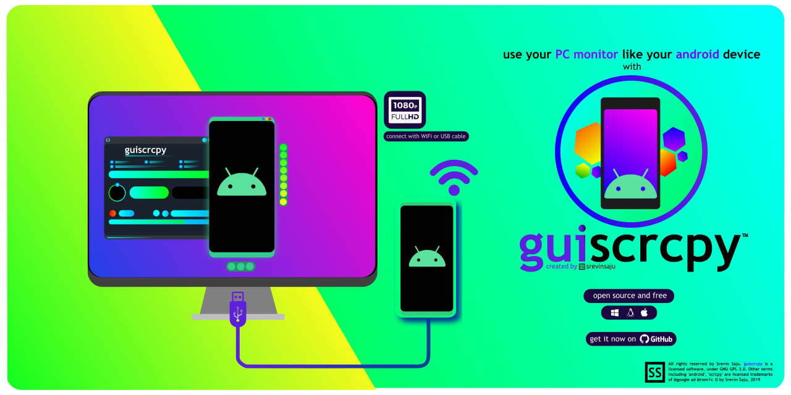
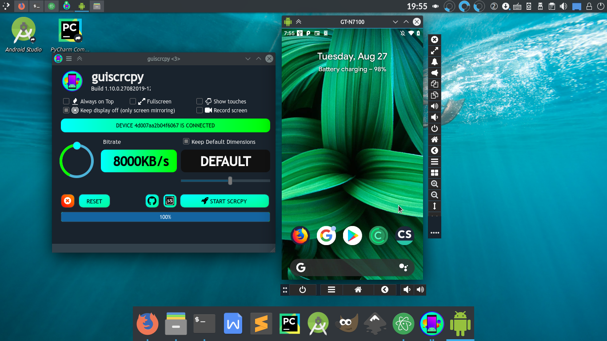

# guiscrcpy

guiscrcpy is a multiplatform, ready-to-use GUI layer for Android to PC screen mirroring written in the advancing programming language python3 for the most award winning open-source android screen mirroring system -- `scrcpy` located on `https://github.com/genymobile/scrcpy/` by [@rom1v](https://github.com/rom1v)

**NOTE**:
Make sure you [enabled adb debugging][enable-adb] on your device(s).

[enable-adb]: https://developer.android.com/studio/command-line/adb.html#Enabling

## Download

|           | Ultra fast download | GitHub Release download   | Nightly Downloads (bin)|
|---------  |------------           |------------               |--- |
|  Windows | [**1.11.0** Windows 32/64 bit](https://mega.nz/#!fDAFAACb!N-jhb6GwRR6I-QNQQmy4AJrj0g8L5TQgwrcA4afKB0o)  | [1.10.0 Windows 32/64 bit](https://github.com/srevinsaju/guiscrcpy/releases/download/1.10/guiscrcpy-1.10-27082019-windows.exe) |
|  Linux | [For faster execution, we recommend the **Source code** on Linux](https://github.com/srevinsaju/guiscrcpy/archive/master.zip) or [**1.10.1** Linux (amd64)](https://mega.nz/#!uSJ3yaSS!QMs_hPAG0wkJ0nq6ErT4I61-vT5ABCV9D_bF4-BSmbk) | [1.10.0 Linux (amd64)](https://github.com/srevinsaju/guiscrcpy/releases/download/1.10/guiscrcpy-1.10-27082019-linux) | [**Binary** - Nightly Builds](https://github.com/srevinsaju/guiscrcpy/tree/nightly#guiscrcpy-nightly)

## Table of Contents:
1. [Installation](#Installation)
2. [Features](#Features)
3. [Requirements](#requirements)
3. [Build](#Build)
4. [Where thing go Wrong](#Issues)
5. [Why guiscrcpy?](#why-guiscrcpy)
6. [Future Releases](#future-releases)
7. [Support](#support-me)
8. [Changelog](#changelog)

## Installation
[(skip)](#Features)

`guiscrcpy` can be installed through source code (recommended) or by downloading the release binary (Windows, Linux ~ Nightly Builds).
(Also called Step 0). Put a star on my repo. Gives support to #opensource and me!!

### Installing from pip
It is the easiest way of installing guiscrcpy.
Just use `pip install guiscrcpy`
Replace `pip` with `pip3` if `python3` is not your default version.

### Building from source
It is always recommended to run guiscrcpy from source due to its flexibility and fast I/O speeds. Thanks to Python's interpreter technology, commands are executed faster than ever. The procedure to install guiscrcpy from source is same for all platform or OSes which support python3.

1. Clone the guiscrcpy GitHub repository.
If you have `git` installed, you may run this:
`git clone https://github.com/srevinsaju/guiscrcpy`

If you do not have `git` installed on your system, you may click the drop down menu from `Clone this repository > Download Zip` or [click here.](https://github.com/srevinsaju/guiscrcpy/archive/master.zip)

2. Extract the files to a directory

3. Linux users have a shortcut to do the installation process. Just run `./guiscrcpy-src-installer.sh`. It might ask for sudo password to install it to the application menu. You may either deny it or accept it or edit the script file to match your needs. If the script completes successfully, you might be able to run  `guiscrcpy` from any directory, and see a Desktop launcher from your Appplication Launcher. You may skip step 4. guiscrcpy is ready to use!

4. On Windows, MacOS or Linux, where you didn't run step 3, you should install the dependencies. The dependencies are provided in the requirements.txt file. It is easier to install with
`python3 -m pip install -r requirements.txt`
Use the --user flag to keep the modules limited to the user account.
Alternatively, you can perform
`python3 -m pip install PyQt5 psutil qdarkstyle`
A dependency that is optional is `pystray`, which is meant for developers only.

5. Fire up guiscrcpy with this terminal command on

    * **Linux**:
`guiscrcpy` or click the `guiscrcpy icon` on your desktop launcher!
    * **Windows**: `python3 guiscrcpy`

**NOTE**:

(i) Do not use Ctrl+C or Ctrl+Z to stop the program as it might run into an unresponsive window. Alternatively, use the close button on the panels.

(ii) Before running from source, make sure you have `scrcpy` on your path. You can Google it out, on how to do it. The Windows binary packages `scrcpy` binaries along with it. Using `guiscrcpy-src-installer.sh` also does not require you to consult   `scrcpy` on path

### Installing from Binary
#### Windows     
For Windows, the executable is compiled into an Installer. Download the Portable file from GitHub or Mega, given in the [Downloads section](#Downloads).

You may want to add `guiscrcpy` to the Start Menu, using `Pin to Start` button on Windows Explorer Panel.
#### Linux  
For Linux, download the latest official `guiscrcpy_linux-*` release from GitHub or Mega on [Downloads section](#Downloads), double click the file, and you are good to go.
As pre-requisite, you should do `sudo snap install scrcpy` to install the scrcpy engine.

For Arch Linux and derived OSes, a __third-party maintainer__ has released a `guiscrcpy-AUR` and `guiscrcpy-git`.
See [Arch User Repository](https://aur.archlinux.org/packages/guiscrcpy/)

### MacOS
Unfortunately, I do not own a Mac device, and hence cant compile for one, but it is easy to build one. Read the [build instruction](#Build)

## Features
`guiscrcpy` has many features which is very much required for day to day usage for app developers, common users, students, commerce departments, testers, production managers and helpline centres. Its powerful side panels, bottom panels and floating console makes using almost a touch controlled Android device, completely comprehensive on a Desktop, laptop or a `multitouch` Tablet.

`guiscrcpy` uses USB or WiFi for screen mirroring. In comparison to other android screen mirroring software, `guiscrcpy` uses as less as `6 MiB` on a RAM*, and has high definition screen quality and latency through USB, more than 16MB/s quality. Using WiFi reduces

### **Aim**

It focuses on:
* lightness (native, displays only the device screen)
* performance (30~60fps)
* quality (1920×1080 or above)
* low latency (35~70ms)
* low startup time (~1 second to display the first image)
* non-intrusiveness (nothing is left installed on the device)
   > ~ from [scrcpy README](https://github.com/Genymobile/scrcpy)

guiscrcpy focuses on:
* independent add on controls
* faster execution (no need to waste time to think; oh, what was the command for changing bitrate, etc.)
* configuration writing
* one handed controls
* easy GUI

### **Requirements** : *What you need for `guiscrcpy`*
All the requirements are the same as that of `scrcpy`. A copy of the requirements are given below.

The Android device requires at least API 21 (Android 5.0).

Make sure you [enabled adb debugging][enable-adb] on your device(s).

[enable-adb]: https://developer.android.com/studio/command-line/adb.html#Enabling

On some devices, you also need to enable [an additional option][control] to
control it using keyboard and mouse.

[control]: https://github.com/Genymobile/scrcpy/issues/70#issuecomment-373286323

### **Comparison**: *Why `guiscrcpy` is better*

| Feature       | `guiscrcpy`   | other `*scrcpy*` alternatives  | commercial software   |
| ------------- | ------------- | ------------------------------ | --------------------- |
| Speed         | Faster, as it is independent from scrcpy engine  | Mostly integrated into the engine, making a GUI layer (slower)| Contains Ads or is through Internet, (data charges are inclusive) |
| Language | Python  | C-alternatives | Binary (unknown) |
| Type | Open source (you can edit them) | Open source | Proprietary |
| Other | Can write configuration file and handle events like swipe up, swipe down, App-switch, volume up | Can handle all events which is using a forked version of scrcpy | Can do everything except swipes and pinches |
| Compatibility (PC) | Windows 7 (32/64) / MacOS / Linux   |  Windows 7 (32/64) / MacOS / Linux   | Windows 7 (32/64) / MacOS / Linux  |
| Compatibility (Mobile) | Android 5.0+ (given by scrcpy)| Android 5.0+ | Android 4.4+ |
| Base | scrcpy (original, created by @rom1v | forked scrcpy | no scrcpy |
| Keyboard Shortcuts | All the shortcuts which are mentioned by scrcpy | Unknown | Unknown |

### Connecting *Wirelessly*

_guiscrcpy_ uses `adb` to communicate with the device, and `adb` can [connect] to a
device over TCP/IP:

1. Connect the device to the same Wi-Fi as your computer.
2. Get your device IP address (in Settings → About phone → Status).
3. Open a Command Prompt window in `C:\Program Files\guiscrcpy\` . (needed for only wireless connection)
3. Enable adb over TCP/IP on your device: Type this command `adb tcpip 5555`.
4. Unplug your device.
5. Connect to your device: Type this command: `adb connect DEVICE_IP:5555` _(replace `DEVICE_IP`)_.
6. Run `guiscrcpy` as usual.

It may be useful to decrease the bit-rate and the definition:
[connect]: https://developer.android.com/studio/command-line/adb.html#wireless

> ~ Quoted from scrcpy.

### Contents
The package includes four parts:

#### Main UI controller

It handles all the pre - runtime features and gives flags to the `scrcpy` engine. It also includes a configuration writing system, which write the configuration file to the home directory, so `guiscrcpy` can read the information and run it, without
giving flags quite often.

#### Toolkit UI controller

The `toolkit` is an independent module, which is in
neither way connected to `scrcpy` or `guiscrcpy`, except for launching.
> NOTE: See [Issues: Unable to drag panel](#Issues)

#### Bottom Panel controller

The `bottom_panel` is an additional floating windows
that helps to do basic controlling like **Home Key, Back Key, Power Key**. This include the most important functions, one would like to do with an Android device.
The most important feature of this module, is that **it has no interference with the `scrcpy` SDL layer, and hence maximum speed**
> NOTE: See [Issues: Unable to drag panel](#Issues)

#### SwipeUX panel
The `guiscrcpy v1.11 ` features a Swipe panel. Controlling a multitouch device like Android devices can be limited with a mouse. To enhance this efficiency, a SwipeUX Panel is added to do common swipes on all four directions

##### scrcpy engine
The scrcpy engine, is the classic v1.10 scrcpy, found on [scrcpy's github page by @rom1v](https://github.com/genymobile/scrcpy). On Windows release files, scrcpy, binary executable is also attached to make `PATH` problems easier to solve. On Linux, scrcpy has to be manually downloaded from `snap`. The installation script does it automatically for you.

### Keyboard shortcuts
guiscrcpy includes all the shortcuts that scrcpy packages.
These are all the [keyboard shortcuts](https://github.com/Genymobile/scrcpy#shortcuts)

## Why guiscrcpy?

I have Python as a subject for Class XI, so as a part of it's advanced learning experience,
and because of my daily use of scrcpy, wanted to integrate GUI into the CLIbased app!!
**GUI** stands for Graphical User Interface, and **Py** is not inherited from scrc<b>py</b> but rather from <b>Py</b> for Python

## Manual Building

### Dependencies (for developers)
* `PyQt5`
* `psutil`
* `qdarkstyle`
* `pystray` (optional, developers)
* `PyAutoGui` (optional, developers, Windows only)

### Manual Building
1. (Also called Step 0). Put a star on my repo. Gives support to #opensource!!
2. Install python3. If you don't have it install it from
[Python Software Website](https://python.org) or on Linux by 
`sudo apt install python3.7`

3. Clone my git repo. or copy paste this to your _bash_ 
`git clone https://github.com/srevinsaju/guiscrcpy`

4. Run the Python Package installer `pip` and run the commands below 
 `python3 -m pip install -r requirements.txt` 

5. So you are all set! Run the program by 
 `python3 guiscrcpy`

7. Read [Known Issues](#Issues) if you fall into some errors.

## Future Releases
Surely, guiscrcpy has great scope of improvement.
Compared to paid Screen Mirroring software, scrcpy gives
a lot of advantages, but my future plans are as follows
* ~~Fix HOME_key, BACK_key. (Will have to wait until @rom1v examines my work)~~ Fixed!
* ~~Add better UI support with adb functions out of scrcpy~~ Fixed again!
* Support python3.8.
* Add service running indicator
* ~~Create pre-built installer and files, Will try fbs build system, after a quite while~~ Fixed!

## Issues
### Linux (X Server)
For Linux operating systems, if python raises `Xlib>>ModuleNotFoundError`, then run 

`sudo apt install python3-xlib` 

`sudo apt install python3-qt5`

To use toolkit (development, on Linux only), run: 

`sudo apt install wmctrl xdotool`

### Some buttons not working
Some buttons like `clipboard`, `pinch in/out` are not enabled. But, however, you may enable it by recompiling the source code. I am looking forward for pinching on Android help / Documentation / links.

### Unable to drag Panel or Toolkit
[According to Issue #4](https://github.com/srevinsaju/guiscrcpy/issues/4#) created by [@logix2](https://github.com/logix2), regarding some problems in dragging panels in the Linux OS, in this case, using the `Meta`, `Super` or `Alt` keys, to use the Desktop Window Manager functionality in moving the Panel.

## Support me!
Sponsor me or share your ideas, issues with me on github and email [srevin03@gmail.com](srevin03@gmail.com)!!

## Developers
`guiscrcpy`, on initializing, creates a guiscrcpy.cfg file in
* Windows: `C:\Users\<UserName>\AppData\guiscrcpy.cfg`
* Linux: `~/.config/guiscrcpy.cfg`
* Mac and other OSes: `~/guiscrcpy.cfg`

A user may create backups of configuration file, or edit them manually. It is created by guiscrcpy and stored in the respective
directories.
The structure of the .cfg file is not based on structured language, but based on backslash n (new line) in LF and CRLF file type
The structure is as given below

the cfg file struct::
*        :bitrate0 [Line 4]
*        :dimension0 [Line 5]
*        :swtouches0 [Line 6]
*        :fullscreen0 [Line 7]
*        :dispRO0 [Line 8]

The Line Numbers are based on Python's index numbers, whuch starts from 0 and ends in 8, in this case.

## Credits

Thanks to all of the developers, testers, friends and family who helped me in this project.

Special thanks to
* @logix2 - Issue #5, #7
* @Strubbl - Issue #8
* Panel icons (home, back, bell, etc. located in `\icons\*`) made by Dave Gandy from www.flaticon.com
used under Creative Commons 3.0 Unported.
The original SVG black work by Dave Gandy has ben re-oriented, flipped or color-changed.
The rest of Terms and Conditions put formward by CC-3.0:Unported has been feverently followed
by the developer. Icons have been adapeted in all the three windows.

## Changelog
### Build 1.11.0
* Added `guiscrcpy-src-installer.sh` which installs guiscrcpy to your path and creates a desktop launcher
* Added Swipe UX Windows

### Build 1.10.0

#### Highlights

##### New logo for guiscrcpy
The new logo for `guiscrcpy` has been deployed, licensed under *Creative Commons License Attribution 4.0*. A comparison between old and new. 

 
##### New UI and distributed controls
The new UI aims for faster ergonomics and consumer oriented. Individual modules, now are separate from scrcpy executable to provide speed to the mirroring system. The new UI also looks way better than the old one ;) 

 **OLD**

**NEW**

#### Raw
* Fixed many bugs
* Better UI, based on Material principles
* Switched to dark theme, thanks to  `qdarkstyle`
* Faster `scrcpy` loading. Re-converted `StartScrcpy`
into `MyApp` class. `QThread` is not very fast, as it is said to be.
* Configuration has been updated to add `Keep Display Off`
* Added Orientation change command (potrait / landscape)
* Added user configuration file write to home directory on static line system. Users now automatically save theit information into the `.cfg file`
* Separated main controls from subsidiary controls. Linear layout and horizontal layout are separate.
* Users can now perform top to bottom or bottom to top swipe with notification buttons,
* Button utility is mentioned in tooltip
* Added Reset button to reset user config to defaults.
* Fixed QProgressBar blocking mainthread.

### Build 1.9.6
* Minor Fixes

### Build 1.9.5
25062019 2159
* MEGA CHANGE :: Migrated from `PyQt4` to `PyQt5` due to late realization that PyQt4 support
for Windows is unfortunately discontinued.
* `mainwindow.ui` >> xml parsed file loaded in uic loader has been compiled to `mainui.py` as UI
* toolkit.py is deprecated. toolkit class is restructured into mainwindow class with multiprocesing.
* After `PyQt5` update, GTK-LTK-KDE no longer raises pixmap errors
* Unreleased .ui files for Build. Only dependencies for release are png pixmap files

### Build 1.9.4
23062018 1615 GMT+300
* Dumped terminal QTextEdit for multiprocessing to prevent QThread hang.
* Restructured StartScrcpy Class as two threads.

### Build 1.9.3
22062019 1948 GMT+3
* Fixed GUI hang (issue reported by @rom1v)
(code has been restructured. the old code is placed in `/backup/` folder as `main 1.9.2.py`. But however, terminal ui QTextEdit
is not functional.

### Build 1.9.2
21062019 2000 GMT+3
* Added GUIScrcpy icon
* Added pixmap icons
* Added check scrcpy process running or not
* Added GUIScrcpy Toolkit Experimental Support
###1.9.1
* Initial Build :)
