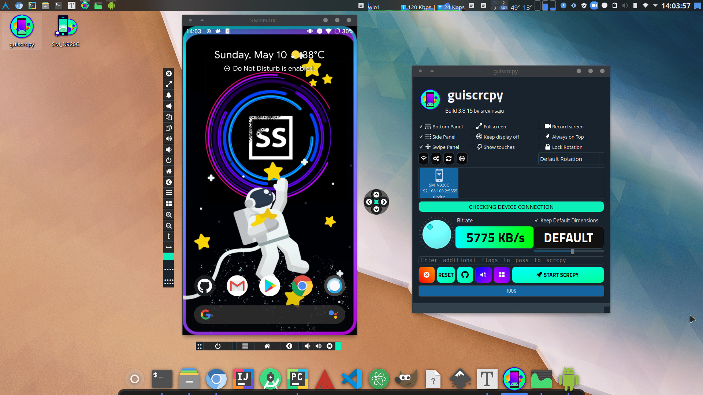

# guiscrcpy

[](https://opencollective.com/guiscrcpy) 

[](https://pyup.io/repos/github/srevinsaju/guiscrcpy/)[](https://pyup.io/repos/github/srevinsaju/guiscrcpy/)[](https://pypi.org/project/guiscrcpy)

[](https://www.srevinsaju.me/get-appimage/guiscrcpy/)

[](https://aur.archlinux.org/packages/guiscrcpy)
[](https://snapcraft.io/guiscrcpy)
[](https://github.com/srevinsaju/guiscrcpy/releases)
[](https://discord.gg/mFqj3a5)
[](https://discord.gg/mFqj3a5)

[](https://www.gnu.org/licenses/gpl-3.0)

----------

 [](https://www.codacy.com/manual/srevinsaju/guiscrcpy?utm_source=github.com&amp;utm_medium=referral&amp;utm_content=srevinsaju/guiscrcpy&amp;utm_campaign=Badge_Grade)

------------

[](https://twitter.com/srevinsaju)

[](https://github.com/srevinsaju)

[](https://www.patreon.com/srevinsaju?fan_landing=true)




guiscrcpy is a multiplatform, ready-to-use GUI layer for Android to PC screen mirroring written in the advancing programming language python3 for the most award winning open-source android screen mirroring system -- `scrcpy` located on `https://github.com/genymobile/scrcpy/` by [@rom1v](https://github.com/rom1v)

<br>

## Installation

These are the common methods of installation. To see more interesting ways, checkout [Installation wiki](docs/INSTALL.md) page for more information, and to find a compatible installtion method for your device and device architecture

| Package Type  | Platforms                                                    | Status                                                       | Command / Link                |
| ------------- | ------------------------------------------------------------ | ------------------------------------------------------------ | ----------------------------- |
| PyPI (`pip`)  |  |  | `pip3 install -U guiscrcpy`   |
| Snap Store    |  | [](https://snapcraft.io/guiscrcpy) | `sudo snap install guiscrcpy` |
| AUR*          |  | [](https://aur.archlinux.org/packages/guiscrcpy) | `yay -S guiscrcpy`            |
| Windows (exe) |  | [](https://github.com/srevinsaju/guiscrcpy/actions?query=+event%3Apush++is%3Asuccess+branch%3Amaster+workflow%3A%22Windows+Executable%22) | `Click on the Status Badge`   |
| AppImage      |  | [](https://github.com/srevinsaju/guiscrcpy/actions?query=event%3Apush+branch%3Amaster+is%3Asuccess+workflow%3AAppImage+) | `Click on the Status Badge`   |

<br>

## Table of Contents

1. [Installation](docs/INSTALL.md) (detailed)
2. [Features](docs/FEATURES.md)
3. [Configuration files](docs/CONFIGURATION.md)
4. [FAQ](docs/FAQ.md)

<br>

## Further reading

Thanks to users around the world, 
guiscrcpy is one of the trending apps this month. 
You may like to see some articles written by well wishers:

* [Mirror your Android screen on your computer with Guiscrcpy - opensource.com](https://opensource.com/article/19/9/mirror-android-screen-guiscrcpy)
* [Helper GUI For scrcpy, The Android Desktop Display And Remote Control Tool - linuxuprising.com](https://www.linuxuprising.com/2019/09/helper-gui-for-scrcpy-android-desktop.html)
* [Mirror your Android display screen in your laptop with Guiscrcpy - breakingexpress.com](https://breakingexpress.com/2019/09/26/mirror-your-android-display-screen-in-your-laptop-with-guiscrcpy/)
* [guiscrcpy demonstration (windows) - Youtube](https://www.youtube.com/watch?v=Uc1ozt4AtrY)
* [guiscrcpy = OpenCollective](https://opencollective.com/guiscrcpy)


## Acknowledgements

Special thanks to [Jetbrains](https://www.jetbrains.com/?from=guiscrcpy) for sponsoring `guiscrcpy` with
a professional PyCharm IDE; It works fantastic!!3

[](https://www.jetbrains.com/?from=guiscrcpy)

## Contributors

### Code Contributors

This project exists thanks to all the people who contribute. [[Contribute](CONTRIBUTING.md)].
<a href="https://github.com/srevinsaju/guiscrcpy/graphs/contributors"></a>

### Financial Contributors

Become a financial contributor and help us sustain our community. [[Contribute](https://opencollective.com/guiscrcpy/contribute)]

#### Individuals

<a href="https://opencollective.com/guiscrcpy"></a>

#### Organizations

Support this project with your organization. Your logo will show up here with a link to your website. [[Contribute](https://opencollective.com/guiscrcpy/contribute)]

<a href="https://opencollective.com/guiscrcpy/organization/0/website"></a>
<a href="https://opencollective.com/guiscrcpy/organization/1/website"></a>
<a href="https://opencollective.com/guiscrcpy/organization/2/website"></a>
<a href="https://opencollective.com/guiscrcpy/organization/3/website"></a>
<a href="https://opencollective.com/guiscrcpy/organization/4/website"></a>
<a href="https://opencollective.com/guiscrcpy/organization/5/website"></a>
<a href="https://opencollective.com/guiscrcpy/organization/6/website"></a>
<a href="https://opencollective.com/guiscrcpy/organization/7/website"></a>
<a href="https://opencollective.com/guiscrcpy/organization/8/website"></a>
<a href="https://opencollective.com/guiscrcpy/organization/9/website"></a>

## License

```
GUISCRCPY by srevinsaju
Get it on : https://github.com/srevinsaju/guiscrcpy
Licensed under GNU Public License

This program is free software: you can redistribute it and/or modify
it under the terms of the GNU General Public License as published by
the Free Software Foundation, either version 3 of the License, or
(at your option) any later version.

This program is distributed in the hope that it will be useful,
but WITHOUT ANY WARRANTY; without even the implied warranty of
MERCHANTABILITY or FITNESS FOR A PARTICULAR PURPOSE.  See the
GNU General Public License for more details.

You should have received a copy of the GNU General Public License
along with this program.  If not, see <https://www.gnu.org/licenses/>.


Icon made by Dave Gandy from www.flaticon.com used under
Creative Commons 3.0 Unported. The original SVG black work
by Dave Gandy has been re-oriented, flipped or color-changed.
The rest of Terms and Conditions put forward by
CC-3.0:Unported has been feverently followed by the developer.
Icons have been adapted in all the three windows.

Icons pack obtained from www.flaticon.com
All rights reserved.

```

---------------------

Copyright &copy; [Srevin Saju](https://github.com/srevinsaju) 2019 - 2020

