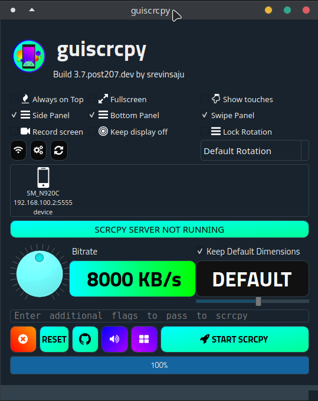
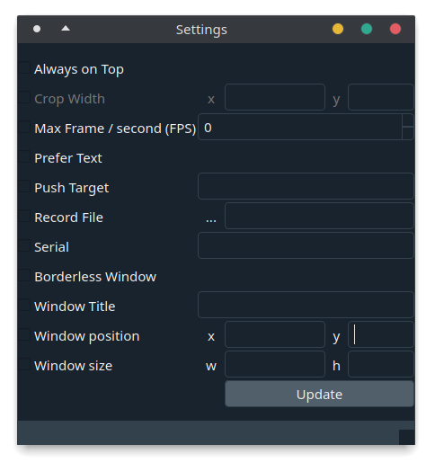
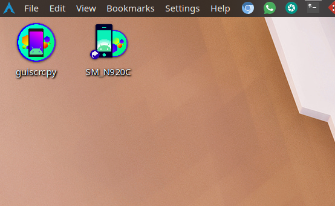
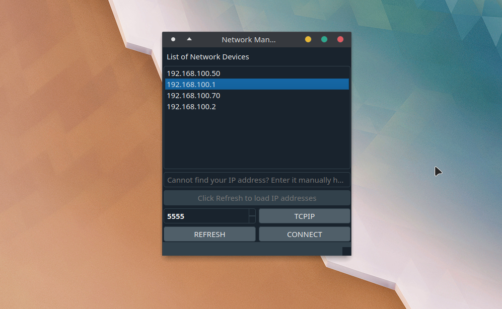
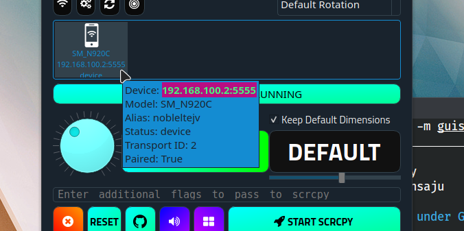

## Features

## Comparison


| Feature       | `guiscrcpy`   | other `*scrcpy*` alternatives  | commercial software   |
| ------------- | ------------- | ------------------------------ | --------------------- |
| Speed         | Faster, as it is independent from scrcpy engine  | Mostly integrated into the engine, making a GUI layer (slower)| Contains Ads or is through Internet, (data charges are inclusive) |
| Language | Python  | C-alternatives | Binary (unknown) |
| Type | Open source (you can edit them) | Open source | Proprietary |
| Other | Can write configuration file and handle events like swipe up, swipe down, App-switch, volume up | Can handle all events which is using a forked version of scrcpy | Can do everything except swipes and pinches |
| Compatibility (PC) | Windows 10+ / macOS 10.15+ / Linux |  Windows 7 (32/64) / macOS / Linux   | Windows 7 (32/64) / macOS / Linux  |
| Compatibility (Mobile) | Android 5.0+ (given by `scrcpy`) | Android 5.0+ | Android 4.4+ |
| Base | `scrcpy` (original, created by @rom1v | forked `scrcpy` | no `scrcpy` |
| Keyboard Shortcuts | All the shortcuts which are mentioned by `scrcpy` | Unknown | Unknown |
| Official Packages provided | AppImages, Snaps, Windows Executable, Python Binary (pip wheels), Source Code | Unknown | Windows Binary, macOS Binary |

## Highlights

#### Customized settings for [`scrcpy`](https://github.com/Genymobile/scrcpy)

`scrcpy` is a android screen mirroring command line interface tool. It does not save your configuration for your each run. Moreover, it requires some command line knowledge of how to use scrcpy and some developer background. There are already many unnecessary issues on `scrcpy`‘s repository, which is caused due to the complexity at which scrcpy’s options are handled. `guiscrcpy` makes use of this complexity and converts into a simple graphical user interface which creates `scrcpy ` 

> Configuration files not stored? Check the [FAQ](FAQ.md)

### Slick GUI



> The user interface may vary from version to version

The GUI is built with the help of `PyQt5`, It includes all the important command line functions that `scrcpy` can support. Along with the *checkboxes* on the main *sceen*; there is also additional settings in the settings menu



Connecting your device over the internet is also easy as pie on `guiscrcpy`‘s Network Manager. This gets rid of all the commands you have to run to make your device connected to your PC.

 <br>

### Toolkits and Panels

`guiscrcpy` bundles side panels, bottom panels and an additional unique swipe panel, which does not exist in other screen mirroring clients. 

##### Swipe Panel (`guiscrcpy.ux.swipe.SwipeUX`)

Swipe Panel is a handy tool for users finding it relatively difficult to perform a swipe on the `scrcpy` client. The `swipe` buttons help to do traditional horizontal and vertical swipes on the screen.


##### Toolkit (Side Panel) (`guiscrcpy.ux.toolkit.ToolkitUX`)


##### Bottom Panel (`guiscrcpy.ux.panel.PanelUX`)

The bottom panel is useful for devices with hardware buttons and which do not have on-screen navigations or `Android 10`‘s Gesture Navigation. To cope up with these functions; `guiscrcpy` included a bottom panel which can do all the basic functions similar to an android navigation bar.


### Multi-device Support

One of the important features `guiscrcpy` v3.7+ includes is multiple device support. This reduces the hard work which happens in `scrcpy`to enter the `device serial_id` to connect to a device if multiple devices are found. 

[](https://github.com/srevinsaju/guiscrcpy/releases/tag/3.7)

You can notice that each of the panels are identified by a unique color represented by the device salted hash of your identifier. It might be interesting to note that; a single device may be identified by two colors if its connected over two tunnels, example `USB` and `TCP`

<br>

### Desktop shortcut

`scrcpy` is a command line interface, which seems quite non intuitive for users who do not use command line / non-developers. `guiscrcpy` creates a one click desktop shortcut, which enables users to start `guiscrcpy` by clicking on their desktop shortcut

#### guiscrcpy

From v3.5, thanks to @cameel for pointing out, a desktop shortcut is created on install on Linux (`pip`, `snap`, `appimaged`) and Windows (`pip`) This makes running guiscrcpy easier for end users. 

#### shortcut to your favorite device

Whether your device is connected over `WiFi` or if what you all need is a `click` away from your device, then the best option is implemented in `guiscrcpy` to create a desktop shortcut to your device. `guiscrcpy` now automates all the procedure you would like to do before and the hard work of the extra commands you had to put in to make your device work over WiFi. 




> **NOTE** : It is possible that a desktop file is not created, when `Create Desktop Shortcut` is pressed. Please refer [FAQ (4)](FAQ.md#4_Desktop_files_not_created)

<br>

### Network Management

#### Port scanner 

> (`Linux`, `macOS`, `Windows (test)`)

It has been an ever hard process to remember the dynamic IP addresses of your device. With `guiscrcpy` its easier to connect to your device wherever you are. Even if you do not want to scan for them, you can right away configure your IP address and then and select your port of the device you would like to connect to.



#### TCP/IP and `adb connect`

It is possible to ask your device to connect to the LAN to enable wireless support. For that; just click the `TCPIP` button; if the process completes successfully, disconnect your device. 

To get wireless connection, you will need to know the local `IP` address of your device. Alternatively, click the `REFRESH` button to select from the list.

After the selection is complete, you can click the `CONNECT` button. Provided the port and the IP address is correct, you are likely to have connected to your devices. You can test if your connection was successful by pressing the `Refresh` icon   on the main user interface, you are likely to see your device in the devices view?

> Can’t see your device? Check if your device is listed when

<br>

### Device information



`guiscrcpy` provides all the information necessary for an android developer.

As seen in the picture, the way to decipher it:

* `Device` : [<identifier>]

  Identifier is the unique id used by `adb` and `scrcpy` to connect to your device. It is also known as `serial id` and can be provided to `adb` with the `-s` or `--serial` tag to forward commands to a specific device

  Each identifier is a unique device known to `guiscrcpy`. `guiscrcpy` connects to devices on the basis of their serial id only. It is possible that a person can have two devices with the same model; but however it is not possible for two devices on the same IP address or with the same serial id

* `Alias`: [<alias>]

  Alias is used by Custom ROM developers for building a custom ROM from the name of the device. Each device has a specific code name for installing `TWRP` or doing `Odin`

* `Paired`: [<bool>]

  Pairing status to configuration file is denoted here. Device is paired to guiscrcpy only on the first successful launch of scrcpy to the device. Properties like custom rotation and other device specific features are stored to the configuration file. 

<br>

### `usbaudio`

[`usbaudio`](https://github.com/rom1v/usbaudio) is a audio client written by @rom1v, to stream device audio to system with the help of [VLC](https://www.videolan.org/vlc/index.html). `guiscrcpy` has already included the GUI entry point for `usbaudio`. Make sure `usbaudio` is on `PATH` and then click the `usbaudio` button   on the main gui.

<br>

### Touch - Key Mapper

Touch key mapper is a highly requested feature of `guiscrcpy` and is highly under testing only. I have manually enabled support for single devices (one device at a time) configuration on guiscrcpy mapper

#### Setting up `mapper`

Mapper is easy to set up on the first attempt; you will need to start a terminal to execute the commands nevertheless. 

Make sure your device is connected and can be detected.

```bash
guiscrcpy adb-interface devices
```

You should be able to see your device on the list.

If you can see your device, then you can proceed to the next steps.

* Turn on your device screen. Make sure your device screen doesn’t turn off. Then run the following command 

```bash
guiscrcpy --mapper
```

* On the first time initialization, it _should normally_ open a new window with the screenshot of your device.

  

* Click on the point once where you want to attach a key. For example, I want to touch the camera icon on the picture.
* Now, without clicking any other part of the screen; enter the character which you want to assign to that camera icon. I want to click the position of camera when I click C, so I type `C` in the text box on the top-left corner
* Click OK
* Repeat the above procedure for the rest of the points
* Close the window when you are done.

> Note: You may also follow the on-screen instructions. Due to the lack of time; many commits are not spent for `guiscrcpy-mapper`. If you are interested on working on this part, you may create a PR. If you know of any other (open source) software you would like to integrate with `guiscrcpy`, you may let me know in an Issue.

Now, run guiscrcpy as usual. 

Key mapper is not enabled by default as it conflicts with input text. To enable the keymapper for a session, click  and it will load in a few moments.

------------------

